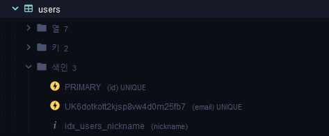
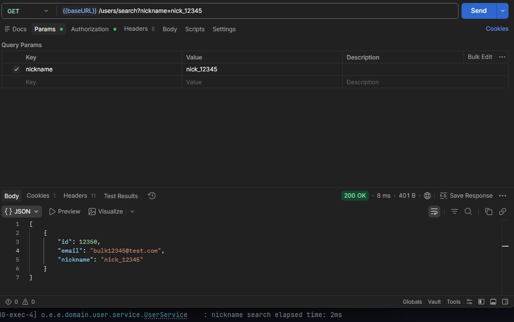

# Spring Plus 과제

---
## 구현 단계

- Level 1 필수 기능 1번 ~ 5번 구현
- Level 2 필수 기능 6번 ~ 9번 구현
- Level 3 도전 기능 10번 ~ 13번 구현

---
## 주요 구현 내용

### 1. Transactional 오류 해결

할 일 저장 API 호출 시 read-only 트랜잭션에서 insert가 발생하여 오류가 발생하던 문제를 수정했습니다.

- 할 일 저장 메서드에 쓰기 트랜잭션 적용
- `/todos` 저장 API 정상 동작 확인

### 2. JWT nickname 추가

User 정보에 nickname을 추가하고, JWT claim에도 nickname을 포함하도록 수정했습니다.

- `users` 테이블에 nickname 컬럼 추가
- 회원가입 요청에 nickname 추가
- JWT 생성 시 nickname claim 추가
- 인증 사용자 정보에서 nickname 사용 가능하도록 수정

### 3. JPQL 기반 할 일 검색 조건 추가

기존 할 일 목록 조회 API에 검색 조건을 추가했습니다.

- weather 조건 검색
- 수정일 시작/종료 기간 검색
- 조건이 없으면 전체 조회
- JPQL optional 조건 사용
- 수정일 내림차순 정렬

### 4. TodoController 테스트 수정

할 일 단건 조회 실패 테스트의 기대값을 실제 전역 예외 처리 응답과 맞췄습니다.

- 존재하지 않는 Todo 조회 시 `400 BAD_REQUEST` 검증
- nickname 추가에 따른 테스트 응답 객체 수정
- Spring Security 적용 후 컨트롤러 테스트에서 필터 제외 설정 추가

### 5. AOP 적용 대상 수정

관리자 권한 변경 API 실행 전에 접근 로그가 남도록 AOP 포인트컷을 수정했습니다.

- 기존 `UserController.getUser` 대상 제거
- `UserAdminController.changeUserRole` 실행 전 동작하도록 변경
- `@After`에서 `@Before`로 변경

### 6. JPA Cascade 적용

할 일을 생성할 때 생성자가 담당자로 자동 등록되도록 수정했습니다.

- `Todo`와 `Manager` 연관관계에 `CascadeType.PERSIST` 적용
- `Todo` 저장 시 생성된 `Manager`도 함께 저장

### 7. 댓글 조회 N+1 문제 해결

댓글 목록 조회 시 댓글 작성자 조회로 발생할 수 있는 N+1 문제를 해결했습니다.

- `CommentRepository` 조회 쿼리에 `JOIN FETCH` 적용
- 댓글과 작성자 User를 한 번에 조회

### 8. QueryDSL 단건 조회 전환

JPQL로 작성되어 있던 `findByIdWithUser`를 QueryDSL로 전환했습니다.

- QueryDSL 의존성 추가
- `JPAQueryFactory` Bean 등록
- Custom Repository 구조 적용
- `fetchJoin`으로 Todo와 User를 함께 조회

### 9. Spring Security 전환

기존 Servlet Filter와 ArgumentResolver 기반 인증 방식을 Spring Security 기반으로 전환했습니다.

- Spring Security 의존성 추가
- `SecurityConfig` 추가
- JWT 인증 필터를 `OncePerRequestFilter` 기반으로 변경
- 인증 정보를 `SecurityContext`에 저장
- 기존 `@Auth` 대신 `@AuthenticationPrincipal` 사용
- `/admin/**` 권한 검사를 Spring Security 인가 기능으로 처리

### 10. QueryDSL 기반 일정 검색 API

QueryDSL과 Projection을 사용하여 일정 검색 API를 추가했습니다.

- API: `GET /todos/search`
- 제목 부분 검색
- 생성일 범위 검색
- 담당자 닉네임 부분 검색
- 생성일 최신순 정렬
- 페이징 처리
- 응답 필드: 제목, 담당자 수, 댓글 수
- 담당자 닉네임 검색용 조인과 담당자 수 집계용 조인을 분리하여 정확한 count 처리

### 11. Transaction 심화

매니저 등록 요청 로그를 매니저 등록 트랜잭션과 분리하여 저장했습니다.

- 로그 엔티티 추가
- 테이블명: `log`
- `LogService`에서 `REQUIRES_NEW` 적용
- 매니저 등록 실패 여부와 관계없이 요청 로그 저장

### 12. 실시간 익명 채팅

WebSocket과 STOMP를 사용하여 익명 채팅 기능을 구현했습니다.

- WebSocket endpoint: `/ws/chat`
- 메시지 발행 prefix: `/pub`
- 메시지 구독 prefix: `/sub`
- 채팅 메시지 전송: `/pub/chat/message`
- 채팅방 구독: `/sub/chat/rooms/{roomId}`
- 채팅 메시지 DB 저장
- 채팅방별 이전 메시지 조회 API 추가
- 테스트 페이지 `chat.html` 추가

### 13. 대용량 데이터 처리

유저 100만 건을 생성하고 nickname 검색 성능을 개선했습니다.

- JDBC `batchUpdate`를 사용한 Bulk Insert 테스트 작성
- 유저 100만 건 생성
- nickname 정확 일치 검색 API 추가
- nickname 컬럼 인덱스 추가
- DTO Projection으로 필요한 필드만 조회

---
## API 테스트 방법

- ### 닉네임 검색

```http
GET /users/search?nickname=nick_500000
Authorization: Bearer {token}
```

- ### 일정 검색

```http
GET /todos/search?title=회의&managerNickname=철수&page=1&size=10
Authorization: Bearer {token}
```

- ### 채팅 메시지 전송

WebSocket 연결:

```text
/ws/chat
```

구독 경로:

```text
/sub/chat/rooms/room-1
```

전송 경로:

```text
/pub/chat/message
```

전송 메시지:

```json
{
  "roomId": "room-1",
  "sender": "익명123",
  "message": "안녕하세요"
}
```

- ### 채팅 내역 조회

```http
GET /chat/rooms/room-1/messages
```

---
## 대용량 데이터 성능 비교

테스트 환경:

- 데이터 수: 1,000,000건
- 검색 조건: nickname 정확 일치
- 테스트 API: `GET /users/search?nickname={nickname}`

| 단계 | 개선 방법 | 조회 시간 |
| --- | --- |-------|
| 1 | 인덱스 없음, 엔티티 조회 | 19ms  |
| 2 | nickname 인덱스 추가 | 2ms   |
| 3 | nickname 인덱스 + DTO Projection | 1ms   |

## 성능 개선 과정

### 1. 인덱스 없음
nickname 조건으로 검색할 때 전체 users 테이블을 탐색할 수 있어 조회 시간이 오래 걸렸습니다.


### 2. nickname 인덱스 추가

검색 조건으로 자주 사용하는 nickname 컬럼에 인덱스를 추가했습니다.

```java
@Table(
    name = "users",
    indexes = {
        @Index(name = "idx_users_nickname", columnList = "nickname")
    }
)
```



### 3. DTO Projection 적용

User 엔티티 전체를 조회하지 않고, 응답에 필요한 id, email, nickname만 조회하도록 변경했습니다.


---
## 트러블슈팅 및 고민한 부분

### 1. QueryDSL 검색에서 담당자 수가 이상하게 계산되는 문제

담당자 닉네임 검색 조건과 담당자 수 계산에 같은 join alias를 사용하면, 닉네임 조건에 매칭된 담당자만 count되는 문제가 있었습니다.

이를 해결하기 위해 닉네임 검색용 join과 담당자 수 계산용 join을 분리했습니다.

### 2. Spring Security 전환 후 테스트 실패 문제

Spring Security 필터가 컨트롤러 단위 테스트에도 적용되어 인증이 필요한 상태가 되었습니다.

컨트롤러 테스트의 목적은 보안 필터 검증이 아니므로 `@AutoConfigureMockMvc(addFilters = false)`를 적용했습니다.

### 3. 매니저 등록 로그 트랜잭션 분리

매니저 등록이 실패해도 로그는 반드시 저장되어야 했기 때문에 `REQUIRES_NEW`를 사용했습니다.

같은 클래스 내부 메서드 호출은 Spring 프록시를 거치지 않을 수 있으므로, 로그 저장 책임을 `LogService`로 분리했습니다.

### 4. WebSocket destination 불일치 문제

처음 테스트할 때 send destination과 subscribe destination이 서버 설정과 달라 메시지가 Controller까지 도달하지 않았습니다.

정확한 경로는 다음과 같습니다.

- send: `/pub/chat/message`
- subscribe: `/sub/chat/rooms/{roomId}`

---

## 학습 및 이해 정리

### 1. JPA Lazy Loading과 Proxy

이번 과제에서는 `Todo.user`, `Comment.user`, `Manager.user` 같은 연관관계를 `LAZY`로 유지했습니다.

LAZY 로딩은 연관 엔티티를 즉시 조회하지 않고, 실제로 해당 필드에 접근할 때 Proxy 객체를 통해 조회하는 방식입니다. 이 방식은 불필요한 조회를 줄일 수 있지만, 반복문 안에서 연관 엔티티에 접근하면 N+1 문제가 발생할 수 있습니다.

댓글 조회에서는 `comment.getUser()` 접근 시 댓글 수만큼 User 조회가 추가로 발생할 수 있어 `JOIN FETCH`를 사용해 댓글과 작성자를 한 번에 조회하도록 개선했습니다.

### 2. JPA 연관관계 설정

`Todo`는 작성자인 `User`와 N:1 관계를 가지고, 댓글과 담당자는 각각 1:N 관계를 가집니다.

- `Todo -> User`: 다대일 관계
- `Todo -> Comment`: 일대다 관계
- `Todo -> Manager`: 일대다 관계
- `Manager -> User`: 다대일 관계

각 엔티티의 책임을 분리하고, 조회 성능이 필요한 부분에서는 fetch join 또는 QueryDSL fetchJoin을 사용했습니다.

### 3. Cascade 이해

할 일을 생성할 때 생성자를 담당자로 자동 등록하기 위해 `Todo.managers`에 `CascadeType.PERSIST`를 적용했습니다.

`Todo` 생성자에서 `Manager` 객체를 생성하고, `Todo`를 저장할 때 연관된 `Manager`도 함께 저장되도록 했습니다.

이를 통해 별도의 `managerRepository.save()` 호출 없이도 생성자가 담당자로 등록되도록 구현했습니다.

### 4. Transaction 이해

할 일 저장, 매니저 등록, 댓글 저장처럼 DB 상태를 변경하는 메서드에는 쓰기 트랜잭션을 적용했습니다.

특히 매니저 등록 로그 저장 기능에서는 `REQUIRES_NEW`를 사용했습니다. 매니저 등록은 실패할 수 있지만 로그는 반드시 남아야 하기 때문에, 로그 저장 트랜잭션을 매니저 등록 트랜잭션과 분리했습니다.

### 5. N+1 문제 이해

댓글 목록 조회와 할 일 단건 조회에서 연관된 User를 함께 사용하기 때문에 N+1 문제가 발생할 수 있었습니다.

- 댓글 조회: JPQL `JOIN FETCH` 적용
- 할 일 단건 조회: QueryDSL `fetchJoin()` 적용

이를 통해 연관 엔티티를 필요한 시점에 한 번에 조회하도록 개선했습니다.

### 6. 예외 처리 이해

기존에는 예외 응답을 Map으로 구성했지만, 응답 형식을 명확히 하기 위해 ErrorResponse DTO를 사용할 수 있도록 구조를 개선했습니다.

또한 Validation 예외와 예상하지 못한 서버 예외를 GlobalExceptionHandler에서 처리하도록 하여, 클라이언트가 일관된 에러 응답을 받을 수 있도록 했습니다.

### 7. 테스트 이해

컨트롤러 테스트에서는 Service를 Mock 처리하여 컨트롤러 응답만 검증했습니다.

Spring Security 전환 후에는 컨트롤러 테스트가 인증 필터에 막히지 않도록 `@AutoConfigureMockMvc(addFilters = false)`를 적용했습니다.

Repository 테스트에서는 QueryDSL custom repository가 동작할 수 있도록 `PersistenceConfig`를 import했습니다.

### 8. 대용량 데이터 처리 이해

100만 건 유저 데이터를 JPA `saveAll()`이 아니라 JDBC `batchUpdate`로 생성했습니다.

JPA 방식은 영속성 컨텍스트에 많은 엔티티가 쌓여 메모리 부담이 커질 수 있기 때문에, 대용량 insert에는 JDBC batch 방식이 적합하다고 판단했습니다.

nickname 검색 성능 개선을 위해 다음 순서로 비교했습니다.

1. 인덱스 없음 + 엔티티 조회
2. nickname 인덱스 + 엔티티 조회
3. nickname 인덱스 + DTO Projection

이를 통해 인덱스와 Projection이 조회 성능에 어떤 영향을 주는지 확인했습니다.